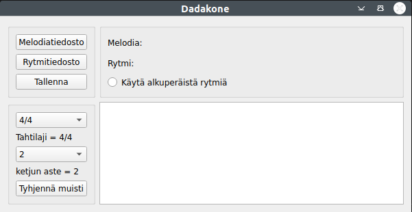

## Asennus

1. Asenna riippuvuudet komennolla:

```bash
poetry install
```

2. Sovellus käynnistyy komennolla:

```bash
poetry run invoke start
```


## Päänäkymä



ylä vasen:
- Melodiatiedosto on se jonka perusteella tehdään tonaalinen materiaali. Näitä voidaan lisätä useampia.
- Rytmitiedosto on rytmin perustana joko sellaisenaan tai markovin ketjujen materiaalina.
- Tallenna tallentaa miditeidoston voimassa olevilla asetuksilla.

ylä oikea:
- Melodia = viimeeksi valittu melodiatiedosto.
- Rytmi = rytmin muodostamiseen valittu tiedosto.
- Käytä alkuperäistä rytmiä mahdollistaa valita tehdäänkä rytmi markovin ketjujen avulla vai käyttäänkö rytmi tiedoston rytmi sellaisenaan.

ala vasen:

- ketjun aste tarkoittaa sitä kuinka pitkiä sekvenssejä tallennetaan triehen ja vastaavasti kuinka pitkä on sekvenssi jonka perusteella haetaan seuraavaa arvoa. Data tallennetaan triehen  syvyys + 1 pitkinä osajonoina.


- kansiossa data on joitan midifilejä joita voi käyttää materiaalina. Kansiossa moniääniset on neliäänisiä koraaleja joita voi kokeilla mutta niiden osalta toiminnot ovat keskeneräisiä.


## Testus

- Sovellusta voi tastata seuraavilla komennoilla:

```bash
poetry run invoke test
```

```bash
poetry run invoke coverage
```

```bash
poetry run invoke report
```

```bash
poetry run invoke lint
```

