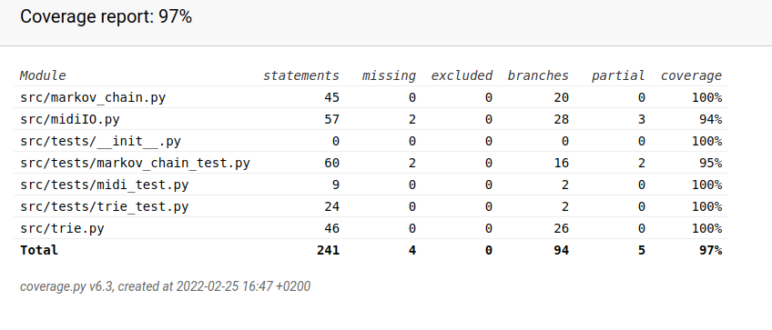

## Testausdokumentti

Ohjelmaa on testattu automatisoiduilla yksikköteillä unittestilla sekä manuaalisesti järjestelmätasolla. Sovellusta on testattu myös erityisillä testimidifileillä jolla on testattu että markovin ketjujen muodostuminen on odotettua. Ne sijaitsevat data/testit kansiossa. Näiden avulla on mahdollista selvittää että markovin ketjut eivät tuota opetusdatassa olemattomia sekvenssejä. Saadun informaation perusteella on markovin ketjun tuottavaa doArray metodia korjattu. Nämä testit on toteutettu järjestelmätasolla. Myös midiI0.py luokan testauksessa on hyödynnetty midifilejä jotka sijaitsevat data kansiossa.

## Sovelluslogiikka

Sovelluslogiikasta vastaavaa `Service`-luokkaa on testattu järjestelmätasolla.

### Testauskattavuus

Sovelluksen testauksen haarautumakattavuus on 97%

### Laadullinen vertailu
Sovellusta on testtattu erityisesti laadullista vertailua varten tehdyllä testi materiaalilla joka koostuu viidestä erillisestä melodiasta jotka on transponoitu samaan sävellajiin. Laadullisesti testattaessa esi asteisia matkovin ketjuja on helppo huomata että neljänne asteen ketjuilla tavoitetaan melodioiden harmoonista rakennetta verrattain paremmin kuin ensimmäisen asteen ketjuilla.

Ensimmäisen asteen ketjulla toteutettu melodia

Neljännen asteen ketjulla toteutettu melodia

Mielenkiintoista on huomata että neljännekin asteen kejulla ja näinkin pienellä testidatalla syntyy merkittävästi variaatiota.

Toinen neljännen asteen ketjulla toteutettu melodia

Edeltävät näytteet on toteutettu samalla rytmisekvenssillä. Onkin helppo huomata että rytmin osalta matkovin ketjut toimivat selvästi heikommin kuin melodian osalta. Tämä on seurausta nuottiarvojen pienemmästä varianssista. Erittäin tyypillistä on että yksi rytmiarvo sekoittaa iskualojen lunnollisen painotuksen ja syntyy pitkä synkooppiketju joka on musiikissa yleisesti ottaen melko harvinainen. Mikäli melodioita haluaisi tehdä tällä menetelmällä pitäisi jollain muulla tavoin huolehtia että rytminen variaatio ei aiheutaa luonnottonta iskutusta.

Rytmi on synkopoitunut luonnottoman pitkään.

